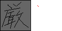
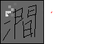

# im2ink

## Overview
This project aims to reconstruct the offline character images back to online handwritten trajectories using an encoder-decoder with attention and GMM.

For questions or more details, please contact us via email addresses: ntuanhung@gmail.com or nakagawa (at) cc.tuat.ac.jp

## Demo

In this part, we provide samples as animated movies rather than static figures in the paper. 
Moreover, we show here more samples than in the paper.

### 1. Recovered samples (Figures 3, 4 and 5 in the paper)

In the following figures, the original trajectories are colored by black and the recovered trajectories are colored by red.
For figures generated by the attention layer, the focused regions on original trajectories at every step are shown by brighter color.

Next, the samples are successfully recovered either with or without the attention layer.

<table align="center">
    <caption><b>Figure 3. Successfully recovered examples.</b></caption>
    <thead>
        <tr>
            <th> </th>
            <th>With attention layer</th>
            <th>Without attention layer</th>
        </tr>
    </thead>
    <tbody align="center">
        <tr>
            <td rowspan=3><b>Samples in paper</b></td>
            <td>
                
                
            </td>
            <td>
                
                
            </td>
        </tr><!-- 00010 -->
        <tr>
            <td>
                
                
            </td>
            <td>
                
                
            </td>
        </tr><!-- 00133 -->
        <tr>
            <td>
                
                
            </td>
            <td>
                
                
            </td>
        </tr><!-- 00417 -->
        <tr>
            <td rowspan=3>Other samples</td>
            <td>
                
                
            </td>
            <td>
                
                
            </td>
        </tr><!-- 00211 -->
        <tr>
            <td>
                
                
            </td>
            <td>
                
                
            </td>
        </tr><!-- 00137 -->
        <tr>
            <td>
                
                
            </td>
            <td>
                
                
            </td>
        </tr><!-- 00086 -->
    </tbody>
</table>

The samples were successfully recovered with the attention layer, but unsuccessfully recovered without the attention layer.

<table align="center">
    <caption><b>Figure 4. Successfully recovered examples with attention.</b></caption>
    <thead>
        <tr>
            <th> </th>
            <th>With attention layer</th>
            <th>Without attention layer</th>
        </tr>
    </thead>
    <tbody align="center">
        <tr>
            <td rowspan=3><b>Samples in paper</b></td>
            <td>
                
                
            </td>
            <td>
                
                
            </td>
        </tr><!-- 00449 -->
        <tr>
            <td>
                
                
            </td>
            <td>
                
                
            </td>
        </tr><!-- 00267 -->
        <tr>
            <td>
                
                
            </td>
            <td>
                
                
            </td>
        </tr><!-- 00186 -->
        <tr>
            <td rowspan=3>Other samples</td>
            <td>
                
                
            </td>
            <td>
                
                
            </td>
        </tr><!-- 00127 -->
        <tr>
            <td>
                
                
            </td>
            <td>
                
                
            </td>
        </tr><!-- 00157 -->
        <tr>
            <td>
                
                
            </td>
            <td>
                
                
            </td>
        </tr><!-- 00179 -->
    </tbody>
</table>

The samples are unsuccessfully recovered either with or without the attention layer.

<table align="center">
    <caption><b>Figure 5. Unsuccessfully recovered examples.</b></caption>
    <thead>
        <tr>
            <th> </th>
            <th>With attention layer</th>
            <th>Without attention layer</th>
        </tr>
    </thead>
    <tbody align="center">
        <tr>
            <td rowspan=3><b>Samples in paper</b></td>
            <td>
                
                
            </td>
            <td>
                
                
            </td>
        </tr><!-- 36177 -->
        <tr>
            <td>
                
                
            </td>
            <td>
                
                
            </td>
        </tr><!-- 33243 -->        
        <tr>
            <td>
                
                
            </td>
            <td>
                
                
            </td>
        </tr><!-- 00009 -->
    </tbody>
</table>

### 2. Unnatural recovered samples (Figure 6(a) in the paper)

Although the following samples are successfully recovered, their online trajectories consist of more points than the original ones, as shown in Figure 6 (a).

<table align="center">
    <caption><b>Figure 6 (a). Sample recovered with unusual pen/touch speed.</b></caption>
    <thead>
        <tr>
            <th> </th>
            <th>Original trajectories</th>
            <th>Recovered trajectories</th>
        </tr>
    </thead>
    <tbody align="center">
        <tr>
            <td><b>Sample in paper</b></td>
            <td></td>
            <td>
                
                
            </td>
        </tr><!-- 00808 -->
        <tr>
            <td rowspan=2>Other samples</td>
            <td></td>
            <td>
                
                
            </td>
        </tr><!-- 02838 -->
        <tr>
            <td></td>
            <td>
                
                
            </td>
        </tr><!-- 01651 -->
    </tbody>
</table>

### 3. Incompletely recovered samples (Figure 6(b) in the paper)

As shown in Figure 6 (b), there are incompletely recovered samples when attention was stuck.

<table align="center">
    <caption><b>Figure 6 (b). Sample whose recovery was stuck.</b></caption>
    <thead>
        <tr>
            <th> </th>
            <th>Original trajectories</th>
            <th>Recovered trajectories</th>
        </tr>
    </thead>
    <tbody align="center">
        <tr>
            <td><b>Sample in paper</b></td>
            <td></td>
            <td>
                
                
            </td>
        </tr><!-- 00331 -->
        <tr>
            <td rowspan=2>Other samples</td>
            <td></td>
            <td>
                
                
            </td>
        </tr><!-- 00688 -->
        <tr>
            <td></td>
            <td>
                
                
            </td>
        </tr><!-- 00361 -->
    </tbody>
</table>
